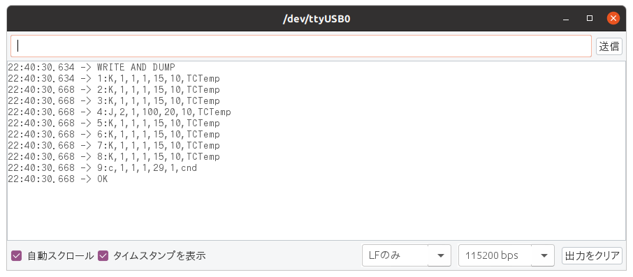

THCP MANUAL
===========

- Version: A00
- Release: 03-May-2021
- Develop: HOLLY&Co.,Ltd.

まだ写真やイラストなどの図表は完備されていません。

# 概要

本装置は、8chの熱電対センサを接続して、そのセンサが計測する温度データをUECS電文にしてネットワーク上に送信(放送)するものです。  
データの蓄積や解析は、このUECSデータを受信したロガー側で実施することになります。

# 安全上の注意

- 注意
- 指示
- 禁止
- 分解禁止

などを記します。まだこれから書きます。

# 使い方

## 接続方法

* 本体の電源スイッチがOFFになっていることを確認。
* AC電源ケーブルを接続。
* LANケーブルを接続。

必要に応じてArduino制御用のUSBコネクタを接続するが、接続と同時に中途半端に電源が入ってしまうのでArduino制御用のUSB接続は主電源が入っている状態で接続使用する事。

LANの設定は全てDHCPにて自動設定でありますが、そのために、同一ネットワーク内にブロードバンドルータなどのDHCPサーバ機能をもったものが必要になります。

## 動作確認

上記の接続を行った後、電源スイッチをONにすると表示器(以下：LCD)に各種のメッセージが表示された後、計測が始まる。バージョン番号などは異なる場合があります。

     THCP Ver:A00     Program名称 バージョン
     ID:10100C000008  UECS-ID

画面が切り替わる  
   

     HW:02A273080001  MACアドレス
     192.168.38.133   IP アドレス

計測が始まると

     _24__25__26__27   ch1〜4の温度表示
     _28__29__30__31   ch5〜8の温度表示

これを表示します(_は表示されません)。表示桁の都合で整数値部のみを表示するが、UECS電文で出力されるのは小数点下2桁までです。

## 熱電対の接続

本体正面左側に並んでいる端子台が熱電対を取り付ける端子になります。  
番号がふっている部分が入力端子で左右の大きさの違うネジは取り付けネジなので間違えないようにしてください。  
上がHOT、下がCOLD側の熱電対電極を取り付けます。

取り付ける熱電対のタイプは別途設定出来ます。

## UECS電文の受信

正常時の電文は上記のようになります。
cnd電文は毎秒、TCTempは10秒毎に送信されます。

## 表示切換

本体正面右側の緑色のボタンを押すと、LCD表示が切り替わります。  
1度押すと、プログラム名とバージョンおよびUESC-IDが表示されます。
約10秒以内にもう一度押すと、MACアドレスとIPアドレスが表示されます。
約10秒経過すると、通常の温度表示に戻ります。

## 設定方法

本装置は、以下の項目を任意に設定することが可能です。
minicom(Linuxの場合)、teraterm(Windowsの場合)、Arduino IDE(色々の場合)、などをArduino USB端子に接続してコマンドを入力します。  
以下の表示は、Arduino IDEのシリアルモニタを用いた場合です。

### d コマンド "設定内容表示"

d文字を入力すると、

結果、このようにCCM定義が表示されます。

    1:K,1,1,1,15,10,TCTemp
    | | | | |  |  |  |
    | | | | |  |  |  +--- CM type名 (変更不可)
    | | | | |  |  +------ 計測間隔(10秒 変更不可)
    | | | | |  +--------- Priority 0〜30で変更可能
    | | | | +------------ Order 0〜30000で変更可能
    | | | +-------------- Region 0〜127で変更可能
    | | +---------------- Room 0〜127で変更可能
    | +------------------ 熱電対タイプ 変更可能
    +-------------------- ch番号 変更の時に必須

    9:c,1,1,1,29,1,cnd
    | | | | |  | |  |
    | | | | |  | |  +---- CM type名 (変更不可)
    | | | | |  | +------- 通知間隔(1秒 変更不可)
    | | | | |  +--------- Priority 0〜30で変更可能
    | | | | +------------ Order 0〜30000で変更可能
    | | | +-------------- Region 0〜127で変更可能
    | | +---------------- Room 0〜127で変更可能
    | +------------------ ダミー (変更不可)
    +-------------------- ch番号 変更の時に必須

### s コマンド "設定内容変更"

s文字を以下のように変更するデータと一緒に入力します。
パラメータとパラメータの間はスペースかカンマを使ってください。

    s 4 j 2 1 100 20
    | | | | |  |   |
    | | | | |  |   +---- Priority 0〜30で変更可能
    | | | | |  +-------- Order 0〜30000で変更可能
    | | | | +----------- Region 0〜127で変更可能
    | | | +------------- Room 0〜127で変更可能
    | | +--------------- 熱電対タイプ K,J,T,N,S,E,B,R型
    | +----------------- ch番号 1〜9 熱電対は1〜8
    +------------------- sコマンド

設定が終わると自動的に設定内容が表示されます。

cndの場合にはch番号を9にして、熱電対タイプは適当に(無視されるので)指定して構いません。
設定直後から動作モードは変わります。
例えば、熱電対タイプをKからTに変えたら直後から熱電対アンプの動作モードはT型に変わります。

### reset コマンド "リセット・再起動"

本装置は、リセットボタンが表に出ていません。
resetコマンドを以下のように入力すると、強制的に再起動します。

数秒経過すると

上記の表示がなされる。
上から、
* プログラム名
* UECS-ID
* MACアドレス
* DHCPで取得したIPアドレス
* UECS電文をブロードキャストするアドレス

# 仕様

## 一般仕様

| 諸元          | 仕様                 | 備考          |
|---------------|---------------------|---------------|
| 名称          | 熱電対センサUECS NODE|略称:THCP      |
| UECS-ID       | 10100C000008        |               |
| 表示器        | LCD 16桁x2行        | ANK文字表示    |
| スイッチ      | トグルタイプ         | 電源入り切り   |
| スイッチ      | プッシュタイプ       | 表示切替      |
| 寸法 WxHxD(mm)| 250x50x200          | 突起物を含まず |
| 重量 (g)      |  665                | 付属品を含まず |

## 電気仕様

|  諸元   |  仕様       |    備考                 |
|---------|------------|-------------------------|
| 電源電圧| AC100〜265V | 50Hz/60Hz 中点アース推奨 |
| 消費電力| 0.5W(最大)  |                         |  

## 計測通信機能仕様

|   諸元    |       仕様              | 備考              |
|-----------|-------------------------|------------------|
| 熱電対種類 | K,J,T,N,S,E,B,R型に対応 | 事前設定が必要    |
| 熱電対接続 | 端子台接続 (M3ビスにて) | HOT/COLDの区別必要 |
| 計測間隔   | 10秒毎に観測および通知  | 変更不可          |
| 無接続端子 | 不定値が送信される      |                   |
| CCM名称   | TCTemp.センサ番号       | センサ番号1〜8    |
| cnd内容   | 常時0を送信する         | 変更不可          |
| 表示内容  | 状態表示                |                  |
| NIC仕様   | 10/100Mbps UDP/IP      | RJ-45             |
| 電文仕様  | UECS仕様に準じる        |                  |
| IP仕様    | IPアドレスはDHCP設定    | 手設定不可        |
| WDT      | 有り                    | 8sec             |

